# ZeroTrust-AI Architecture Mermaid Diagrams

## 1. Complete System Architecture

## 2. Real-time Data Flow Architecture

## 3. SOAR Decision Flow

```mermaid
flowchart TD
    TE[Threat Event] --> RS{Risk Score}
    RS -->|< 0.70| MONITOR[👁️ Monitor Only<br/>Show in feed]
    RS -->|0.70-0.85| MEDIUM{Volumetric?}
    RS -->|≥ 0.85| HIGH{Confidence ≥ 0.90?}
    
    MEDIUM -->|Yes| RATE[⚠️ Rate Limit<br/>Medium-risk containment]
    MEDIUM -->|No| MONITOR
    
    HIGH -->|Yes| BLOCK[🚫 Block IP<br/>High-risk prevention]
    HIGH -->|No| MONITOR
    
    RATE --> REDIS_STORE[💾 Store in Redis<br/>TTL: 24 hours]
    BLOCK --> REDIS_STORE
    MONITOR --> FEED[📊 Add to Threat Feed]
    
    REDIS_STORE --> INFLUX_METRICS[📊 Store Metrics in InfluxDB<br/>Detection Latency, Response Time]
    FEED --> INFLUX_METRICS
    REDIS_STORE --> DASH_UPDATE[📱 Update Dashboard<br/>SOAR Panel]
    INFLUX_METRICS --> DASH_UPDATE
```

## 4. Service Dependencies (Docker Compose)

## 5. Federated Learning Architecture

```mermaid
graph TB
    subgraph "Federated Learning Infrastructure"
        subgraph "Client Sites"
            ENTERPRISE[🏢 Enterprise A<br/>Business Traffic]
            UNIVERSITY[🎓 University B<br/>Academic Traffic]
            DATACENTER[🖥️ Datacenter C<br/>Cloud Infrastructure]
        end
        
        subgraph "Federated Server"
            FED_SERVER[🌐 Federated Server<br/>Model Aggregation]
            GLOBAL_MODEL[📊 Global Model<br/>Distributed Updates]
        end
        
        subgraph "Training Process"
            LOCAL_TRAIN[🔧 Local Training<br/>Privacy-Preserving]
            MODEL_UPDATES[📦 Model Updates<br/>Gradients/Weights]
            AGGREGATION[🔄 Federated Aggregation<br/>FedAvg/FedProx]
        end
    end
    
    ENTERPRISE --> LOCAL_TRAIN
    UNIVERSITY --> LOCAL_TRAIN
    DATACENTER --> LOCAL_TRAIN
    
    LOCAL_TRAIN --> MODEL_UPDATES
    MODEL_UPDATES --> FED_SERVER
    
    FED_SERVER --> AGGREGATION
    AGGREGATION --> GLOBAL_MODEL
    
    GLOBAL_MODEL --> ENTERPRISE
    GLOBAL_MODEL --> UNIVERSITY
    GLOBAL_MODEL --> DATACENTER
    
    classDef client fill:#e1f5fe,stroke:#0277bd,stroke-width:2px
    classDef server fill:#f3e5f5,stroke:#7b1fa2,stroke-width:2px
    classDef process fill:#e8f5e8,stroke:#388e3c,stroke-width:2px
    
    class ENTERPRISE,UNIVERSITY,DATACENTER client
    class FED_SERVER,GLOBAL_MODEL server
    class LOCAL_TRAIN,MODEL_UPDATES,AGGREGATION process
```

## 6. Trust Score Decay Visualization

## 7. Zero Trust Micro-segmentation

```mermaid
graph TB
    subgraph "Network Segments"
        CORPORATE[🏢 Corporate Zone<br/>High Trust]
        UNIVERSITY[🎓 University Zone<br/>Medium Trust]  
        DMZ[🖥️ DMZ Zone<br/>Low Trust]
        HONEYPOT[🍯 Honeypot Zone<br/>Decoy]
    end
    
    subgraph "Policy Enforcement Points"
        GATEWAY[🛡️ Gateway PEP<br/>Network ingress/egress]
        SEGMENT[🔒 Segment PEP<br/>Inter-zone communication]
        ENDPOINT[💻 Endpoint PEP<br/>Host-level enforcement]
        HONEYPOT_PEP[🍯 Honeypot PEP<br/>Attacker containment]
    end
    
    CORPORATE --> SEGMENT
    UNIVERSITY --> SEGMENT
    DMZ --> GATEWAY
    HONEYPOT --> HONEYPOT_PEP
    
    GATEWAY --> CORPORATE
    SEGMENT --> UNIVERSITY
    ENDPOINT --> DMZ
    HONEYPOT_PEP --> GATEWAY
    
    classDef zone fill:#e3f2fd,stroke:#1976d2,stroke-width:2px
    classDef pep fill:#f3e5f5,stroke:#7b1fa2,stroke-width:2px
    
    class CORPORATE,UNIVERSITY,DMZ,HONEYPOT zone
    class GATEWAY,SEGMENT,ENDPOINT,HONEYPOT_PEP pep
```

## 8. PDP vs PEP Architecture

```mermaid
graph TB
    subgraph "Policy Decision Point (PDP)"
        RISK[🧠 Risk Assessment Engine]
        TRUST[📊 Trust Score Calculation]  
        POLICY[🎯 Policy Rule Engine]
        AUDIT[📋 Compliance Audit Log]
    end
    
    subgraph "Policy Enforcement Point (PEP)"
        ENFORCE[🛡️ Traffic Enforcement]
        ACCESS[🔒 Access Control]
        RATE[⚠️ Rate Limiting]
        BLOCK[🚫 IP Blocking]
    end
    
    RISK --> TRUST
    TRUST --> POLICY
    POLICY --> AUDIT
    
    POLICY --> ENFORCE
    ENFORCE --> ACCESS
    ACCESS --> RATE
    RATE --> BLOCK
    
    classDef pdp fill:#e8f5e8,stroke:#388e3c,stroke-width:2px
    classDef pep fill:#fff3e0,stroke:#e65100,stroke-width:2px
    
    class RISK,TRUST,POLICY,AUDIT pdp
    class ENFORCE,ACCESS,RATE,BLOCK pep
```

