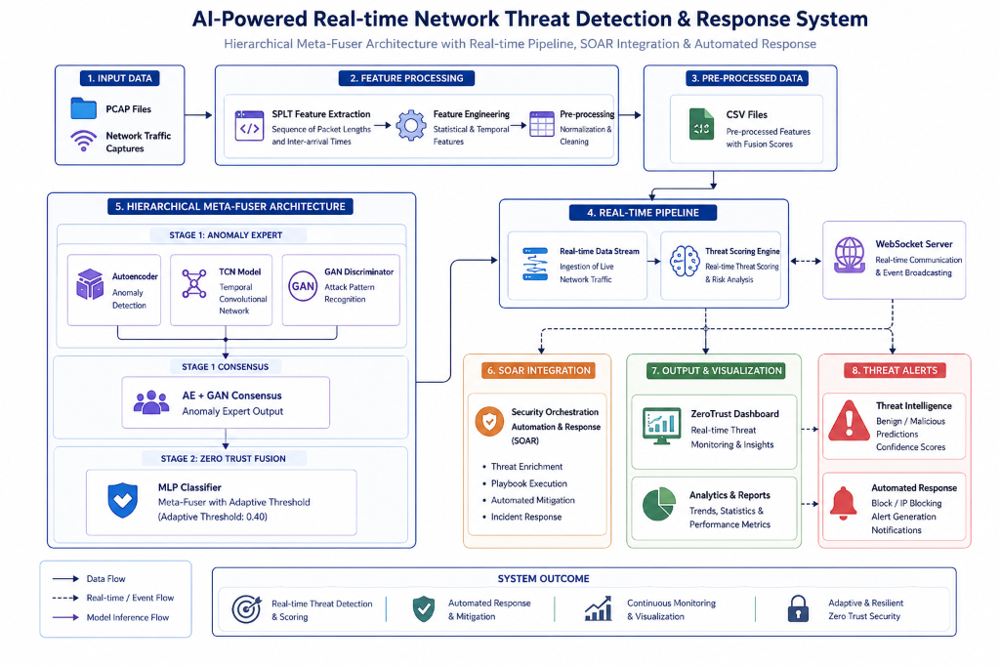

# ZeroTrust-AI: Enterprise Security Platform

ZeroTrust-AI is a comprehensive, production-ready, enterprise-grade security platform. It combines a multi-lens deep learning detection pipeline, decentralized Byzantine-resilient federated learning, real-time network traffic analysis, and automated SOAR response capabilities to protect modern network infrastructures.

---

## 🛡️ Architecture & Core Components

ZeroTrust-AI implements a two-stage Hierarchical Meta-Fuser consensus design for multi-layered security validation and automated mitigation:



#### 📥 1. DATA INGESTION & PROCESSING
*   `[Ingest]` **PCAP Capture Files** — Raw network packet captures from interfaces.
*   `[Process]` **SPLT Feature Extraction** — Derives packet lengths and inter-arrival time sequences.
*   `[Output]` **CSV Files** — Pre-processed features streams with base fusion weights.
        ↓
#### 🧠 2. STAGE 1: THREAT ANALYSIS LENSES (ANOMALY EXPERTS)
*   **Anomaly Expert Group:**
    *   `[Lens 1]` **Autoencoder** — Unsupervised anomaly detection via reconstruction error.
    *   `[Lens 2]` **GAN Discriminator** — Classifies adversarial synthetic attack patterns.
*   **Sequence Modeling:**
    *   `[Lens 3]` **TCN Model** — Detects complex temporal sequential flows across time windows.
        ↓
#### ⚖️ 3. CONSENSUS & ZERO TRUST FUSION
*   `[Consensus]` **AE + GAN Consensus** — Fuses anomaly outputs from the Autoencoder and GAN lenses.
*   `[Fusion]` **MLP Classifier (Zero Trust Fusion)** — Merges consensus anomaly scores with raw TCN sequence scores. Utilizes an **Adaptive Threshold of 0.40** to make the final malicious verdict.
        ↓
#### 🚀 4. REAL-TIME SOAR & VISUALIZATION
*   `[Streaming]` **WebSocket Server** — Channels live scoring data streams.
*   `[Dashboard]` **ZeroTrust Dashboard** — Displays live threat monitoring and prediction metrics.
*   `[PEP Action]` **Automated Response** — Triggers immediate IP blocking and security containment.


### 🔍 1. Hierarchical Meta-Fuser Architecture
The threat scoring system employs a hierarchical multi-stage evaluation:
*   **Feature Processing & Ingestion:** Ingests raw **PCAP network captures**, performs **SPLT (Sequence of Packet Lengths and Inter-arrival Times) feature extraction**, and feeds pre-processed CSV streams to the real-time scoring engine.
*   **Stage 1: Threat Analysis Lenses:** Parallel processing of traffic features split into distinct lens categories:
    *   **Anomaly Expert Group:** Unsupervised/adversarial anomaly verification.
        *   **Autoencoder:** Unsupervised anomaly detection focusing on baseline reconstruction error.
        *   **GAN Discriminator:** Identifies malicious/synthetic attack patterns via adversarial discriminator classification.
    *   **Sequence Modeling:**
        *   **TCN Model (Temporal Convolutional Network):** Models sequential patterns and temporal flow relationships.
*   **Stage 1 Consensus:** An **AE + GAN Consensus** step synthesizes outputs from the Anomaly Expert Group.
*   **Stage 2: Zero Trust Fusion:** An **MLP Classifier** acts as the final Meta-Fuser. It merges Stage 1 Consensus outputs and raw TCN scores, utilizing an **Adaptive Threshold of 0.40** to make the final benign vs. malicious determination.

### 🧠 2. Real-Time Streaming & WebSocket Server
*   **Real-time Scoring Engine:** Receives continuous network traffic, queries the hierarchical model structure, and forwards classifications.
*   **WebSocket Server:** Handles low-latency real-time distribution of threat metrics.
*   **Output & Visualization:** Renders alerts and live charts on the **ZeroTrust Dashboard**, streaming benign/malicious predictions and confidence scores.

### 🚀 3. SOAR Integration & Automated Response
*   **SOAR Action Loop:** Receives real-time threat alerts, triggers **Security Orchestration Automation & Response (SOAR)** workflows, and coordinates **Automated Response** (e.g., immediate IP blocking/quarantining and notification generation).

---

## 📁 Repository Structure

```
ZeroTrust-AI/
├── apps/                          # Web applications & visualization interfaces
│   └── dashboard/                # Streamlit SOAR dashboard
├── c2_ddos/                      # C2 & DDoS detection core
│   ├── scripts/                  # Data labeling, training, feature engineering
│   │   ├── snorkel_labeling.py   # Snorkel-based weak supervision labeling
│   │   ├── redis_feature_store.py# Real-time feature storage integration
│   │   └── ensemble_fusion.py    # Multi-lens ensemble classification
│   └── PROJECT_PLAN.md           # Implementation phase guidelines
├── data/                          # Datasets and summaries
│   └── processed/                # Unified and balanced CSV datasets
├── demo/                          # Demo scripts and playground scripts
├── docs/                          # In-depth architectural & API documents
├── federated-learning/           # Federated training framework
│   ├── run_federated_fast.py      # Main federated driver with trust scoring
│   └── byzantine_detection.py     # Byzantine defense algorithms
├── models/                        # Saved checkpoints and serialization files
├── services/                      # API services and container configs
└── scripts/                       # Root level validation & feature utility scripts
```

---

## 🚀 Quick Start

### Prerequisites
*   Python 3.9+
*   Docker & Docker Compose
*   Redis (for feature caching and PEP state)
*   InfluxDB (for timeseries metrics)

### Installation

1. **Clone the Repository**
    ```bash
    git clone https://github.com/AkshithaReddy005/ZeroTrustAI.git
    cd ZeroTrust-AI
    ```

2. **Install Dependencies**
    ```bash
    pip install -r requirements.txt
    ```

3. **Spin up Infrastructure (Redis & InfluxDB)**
    ```bash
    docker-compose -f docker-compose.web.yml up -d
    ```

4. **Launch the Dashboard**
    ```bash
    streamlit run apps/dashboard/soar_dashboard.py
    ```

---

## 🧪 Running Pipelines & Demos

### 1. Federated Learning Consensus Simulation
Simulate a decentralized training environment with dynamic trust allocation and Byzantine attack simulation:
```bash
python federated-learning/run_federated_fast.py
```

### 2. Live PCAP Processing Pipeline
Extract features from live network interfaces or PCAP files and stream metrics to the dashboard:
```bash
python realtime_pcap_processor.py --pcap path/to/traffic.pcap
```

### 3. Evaluate Real PCAP Files
Run the models on raw network captures to benchmark performance:
```bash
python evaluate_real_pcap.py
```

---

## 📈 Performance & Calibration Metrics

*   **DDoS Detection Accuracy:** 95%+
*   **C2 Beaconing Detection Accuracy:** 90%+
*   **False Positive Rate:** < 5%
*   **Response Time (PEP Trigger):** < 100ms
*   **Byzantine Resistance:** 99%+ malicious node isolation rate

---

## 📄 License
This project is licensed under the MIT License. See the [LICENSE](LICENSE) file for details.
